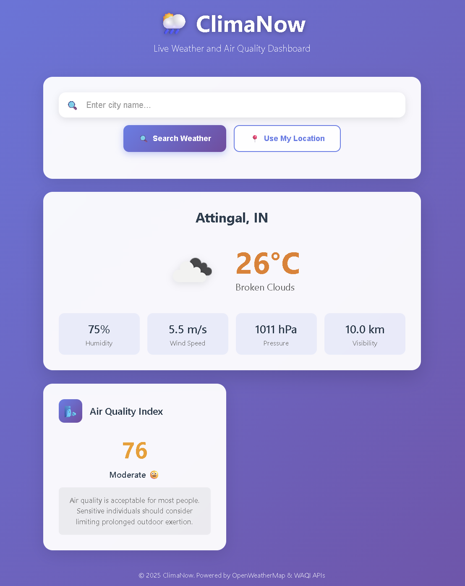

# 🌦️ ClimaNow — Live Weather & Air Quality Dashboard

**ClimaNow** is a sleek, modern web application that provides real-time **weather conditions** and **air quality index (AQI)** for any city. Users can either **search for a city** or **use their current location** to get updates. Built using OpenWeatherMap and WAQI APIs.

---

## 🚀 Features

- 🔍 City-based weather and AQI search
- 📍 Geolocation-based weather detection
- 🌤️ Real-time temperature, humidity, wind, visibility, and pressure
- 🌬️ Air Quality Index (AQI) with descriptive category and health advice
- 🎯 Autocomplete dropdown for city suggestions
- 🌀 Loading spinner while fetching data
- 📱 Mobile-friendly, responsive UI

---

## 🛠️ Tech Stack

- **HTML5**, **CSS3** — UI Design and Styling  
- **JavaScript (Vanilla)** — Client-side Logic  
- **OpenWeatherMap API** — Weather Data  
- **WAQI API** — Air Quality Index  
- **Geolocation API** — Detect User’s Location  

---


---

## ⚙️ Setup Instructions

1. **Clone the repository:**

   ```bash
   git clone https://github.com/YOUR_USERNAME/climanow.git
   cd climanow
2.Insert your API keys inside scripts.js:
const WEATHER_API_KEY = 'YOUR_OPENWEATHERMAP_API_KEY';
const AQI_TOKEN = 'YOUR_WAQI_API_TOKEN';




